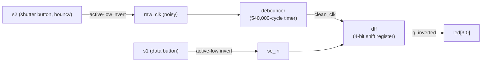
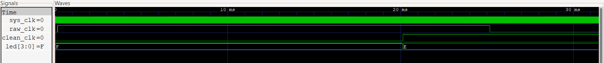
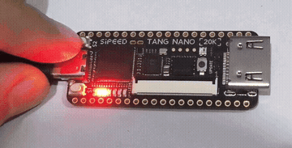

# Button Debouncer + Shift Register - Tang Nano 20K

Small Verilog project I built while learning FPGA basics. Debounces a noisy pushbutton and uses the clean signal to shift data into a 4-bit register shown on the onboard LEDs.

## What's going on here

If you've ever wired up a pushbutton to a microcontroller you probably know the problem - mechanical switches don't make clean contact. When you press or release one, it physically bounces for a couple milliseconds, so instead of one clean transition the signal jitters high/low a bunch of times. A digital circuit reading that raw signal thinks you pressed the button 5 times instead of once.

There are two buttons on the Tang Nano board and I used them like this:

- `s2` is the "shutter" - this is the noisy one, gets cleaned up by the debouncer before I use it anywhere.
- `s1` is just "data" - whatever state it's in gets sampled whenever `s2` gives a clean press.

Basically `s2` works like a manual clock. Every time you press it (once, cleanly), it grabs whatever `s1` is doing right then and shifts it into a 4-bit register. So the LEDs show your last 4 samples at once. If you hold/release s1 between presses of s2 you can literally watch the bit shift across the LEDs.

## The debounce logic

```verilog
always @(posedge clk) begin
  if (btn_in != btn_out) begin
    timer <= timer + 1;
    if (timer >= 540_000) begin
      btn_out <= btn_in;
      timer <= 0;
    end
  end else begin
    timer <= 0;
  end
end
```

Logic here: as long as the raw input doesn't match what we last accepted as "clean", start counting cycles instead of just reacting. If it's actual bounce, the input will flicker back to match `btn_out` at some point and the counter resets to 0. Only if it stays different for 540,000 clock cycles straight do we actually accept it as a real change.

At 27MHz that's about 20ms. Bounce usually settles within a few ms so this comfortably filters it out without adding a delay you'd actually notice when pressing the button.

(540,000 is a bit of a magic number here, I just picked something safely above typical bounce time - could probably make this a parameter later, see the notes at the bottom)

## Block diagram



Couple things worth pointing out:
- `s1`/`s2` are active-low on the board so I invert both right away to work with normal active-high logic.
- `clean_clk` clocks the shift register - so it only shifts on a debounced edge, not the raw noisy one.
- the shift register itself is just `q <= {q[2:0], d}` - nothing fancy.
- LEDs are also active-low so the final output gets inverted again before driving them.

## Files

| File | What it is |
|---|---|
| `debouncer.v` | the debounce module |
| `dff.v` | 4-bit shift register |
| `top.v` | wires everything together - buttons, debouncer, register, LEDs |
| `tb_top.v` | testbench, simulates a bouncy button press |
| `debouncer.cst` | pin constraints for the Tang Nano 20K |

## Simulation

`tb_top.v` fakes a 27MHz clock and simulates s2 bouncing a few times before settling, so you can check the debouncer actually ignores the bounce.

```bash
iverilog -o sim top.v debouncer.v dff.v tb_top.v
vvp sim
gtkwave waveform.vcd
```



`led` starts at `F` since the shift register resets to 0000 (inverted for active-low LEDs). You can see `raw_clk` bounce a bit near the start, but `clean_clk` doesn't budge until the timer's counted its full ~20ms of steady input - right at that point `led` flips to `E`, meaning the register caught exactly one clean sample. Bounce got filtered, only one real edge got through.

Planning to grab a zoomed-in shot of just the bounce region too at some point, would make the "chaos in -> clean out" thing more obvious visually.

## On hardware

Flashed to the Tang Nano 20K through Gowin IDE, s2 being pressed:



## Pins

| Signal | Pin |
|---|---|
| `sys_clk` | 4 |
| `s1` | 88 |
| `s2` | 87 |
| `led[0]` | 15 |
| `led[1]` | 16 |
| `led[2]` | 17 |
| `led[3]` | 18 |

## To build it yourself

1. Open Gowin IDE, add `top.v`, `debouncer.v`, `dff.v`, `debouncer.cst`.
2. Target device = GW2AR-18 (Tang Nano 20K's FPGA).
3. Synth + place & route.
4. Flash over USB.
5. Hold s1 in either state, tap s2, watch the LEDs.

## Todo / ideas

- make the debounce cycle count a parameter instead of hardcoded
- write an actual self-checking testbench instead of eyeballing waveforms
- maybe swap LEDs for a 7-seg or small OLED display, more useful output

---
part of my [vlsi-fundamentals](https://github.com/NeGii44/vlsi-fundamentals) repo, learning Verilog/FPGA stuff alongside GATE 2027 prep
